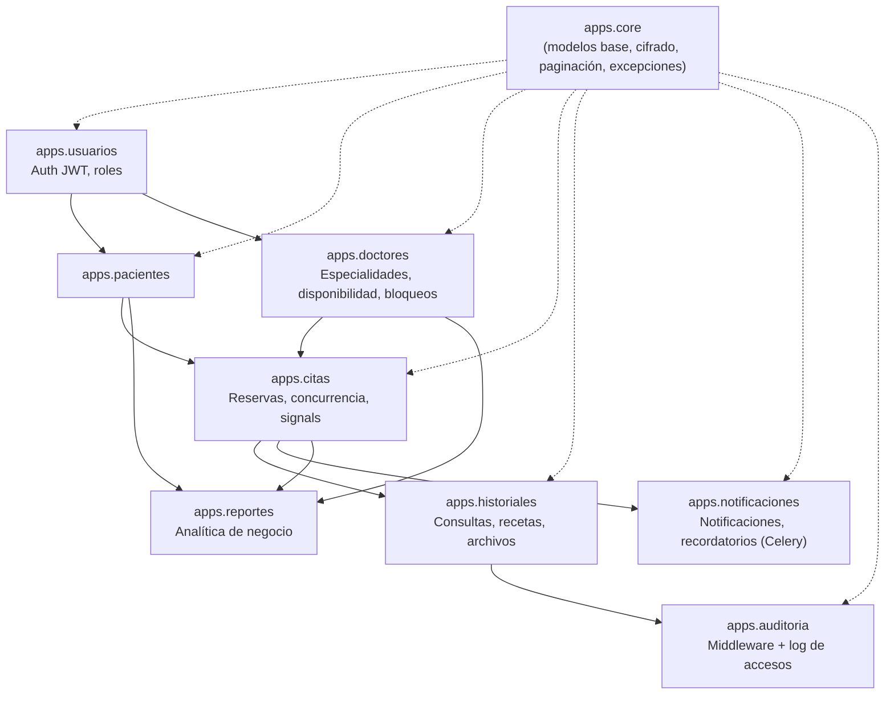

# Sistema de Reservas de Consultas Médicas — API

Backend de una plataforma de agendamiento de citas médicas: gestiona pacientes, doctores, disponibilidad horaria, reservas, historiales clínicos, notificaciones, recordatorios y reportes administrativos, con foco en integridad de datos ante concurrencia, protección de información sensible y trazabilidad de accesos.


## Índice

- [Descripción](#descripción)
- [Características principales](#características-principales)
- [Tecnologías utilizadas](#tecnologías-utilizadas)
- [Arquitectura](#arquitectura)
- [Requisitos previos](#requisitos-previos)
- [Instalación y configuración local](#instalación-y-configuración-local)
- [Variables de entorno](#variables-de-entorno)
- [Ejecución con Docker](#ejecución-con-docker)
- [Estructura de carpetas](#estructura-de-carpetas)
- [Documentación y endpoints de la API](#documentación-y-endpoints-de-la-api)
- [Flujo de funcionamiento](#flujo-de-funcionamiento)
- [Seguridad y protección de datos](#seguridad-y-protección-de-datos)
- [Pruebas](#pruebas)

## Descripción

El sistema resuelve el problema de coordinar citas médicas entre pacientes y doctores evitando dobles reservas, protegiendo datos clínicos sensibles y dejando trazabilidad de quién accede a qué información. Expone una API REST documentada con OpenAPI/Swagger, pensada para ser consumida por un frontend separado (SPA) mediante autenticación JWT.

## Características principales

- **Autenticación JWT** (`djangorestframework-simplejwt`) con modelo de usuario propio (`AUTH_USER_MODEL`), roles `paciente`, `doctor` y `admin`, y email case-insensitive respaldado por la extensión `citext` de PostgreSQL.
- **Agenda y disponibilidad de doctores**: bloques horarios semanales, bloqueos puntuales (licencias, vacaciones) y cálculo de *slots* libres respetando duración de consulta configurable por doctor.
- **Reservas de citas con control de concurrencia en tres capas**:
  1. `select_for_update()` para bloqueo pesimista al crear/reprogramar/cancelar.
  2. `UniqueConstraint` (doctor + hora de inicio, excluyendo canceladas).
  3. `ExclusionConstraint` de PostgreSQL (`btree_gist`) sobre rango `TSTZRANGE`, que impide solapamientos de horario a nivel de base de datos incluso ante condiciones de carrera.
  4. Control de concurrencia **optimista** adicional (`version`) al reprogramar citas.
- **Historiales clínicos con cifrado de campos sensibles**: diagnósticos, tratamientos, alergias, antecedentes, dirección y notas del doctor se cifran a nivel de aplicación con Fernet (AES-128-CBC + HMAC) antes de persistir.
- **Control de acceso granular por objeto** (permisos DRF personalizados): un paciente solo ve sus propios datos; un doctor solo ve pacientes con los que tiene una cita vigente; un admin ve todo.
- **Auditoría automática de accesos**: middleware que registra lecturas/escrituras sobre rutas de historiales clínicos (usuario, IP, ruta, acción, fecha), consultable vía API solo por administradores.
- **Notificaciones y recordatorios asíncronos** con Celery + Redis: se generan automáticamente al crear, confirmar, cancelar o reprogramar una cita (vía *signals*), y se envían por correo con antelación configurable (24 h y 2 h por defecto).
- **Reportes administrativos**: ocupación por doctor, tasa de no-asistencia, demanda por especialidad, disponibilidad proyectada e indicadores generales del negocio.
- **Rate limiting** por *scope* (`autenticacion`, `disponibilidad`, `reserva`) para proteger endpoints sensibles a abuso.
- **Manejo de errores estandarizado**: todas las excepciones de la API responden con un `codigo` de error consistente además del `detail`.
- **Documentación interactiva** generada automáticamente con `drf-spectacular` (esquema OpenAPI 3 + Swagger UI).
- **Comando de datos de demostración** (`cargar_datos_demo`) que genera un dataset completo y realista (especialidades, doctores, pacientes, citas, consultas y recetas) para explorar la API sin cargar datos a mano.

## Tecnologías utilizadas

| Categoría | Tecnología | Versión |
|---|---|---|
| Lenguaje | Python | 3.12 (imagen Docker) |
| Framework web | Django | 5.1.5 |
| API REST | Django REST Framework | 3.15.2 |
| Autenticación | djangorestframework-simplejwt | 5.3.1 |
| Base de datos | PostgreSQL (`psycopg2-binary`) | 16 |
| Filtros / búsqueda | django-filter | 24.3 |
| Documentación API | drf-spectacular | 0.28.0 |
| CORS | django-cors-headers | 4.6.0 |
| Variables de entorno | django-environ | 0.11.2 |
| Cifrado de campos | cryptography (Fernet) | 44.0.0 |
| Tareas asíncronas | Celery | 5.4.0 |
| Broker / result backend | Redis | 5.2.1 |
| Servidor WSGI (prod) | Gunicorn | 23.0.0 |
| Archivos estáticos (prod) | WhiteNoise | 6.8.2 |
| Testing | pytest / pytest-django | 8.3.4 / 4.9.0 |
| Contenedores | Docker / Docker Compose | — |

## Arquitectura

Proyecto Django organizado en apps por dominio de negocio (`apps/`), con un núcleo compartido (`apps.core`) que provee modelos base, campos cifrados, paginación y manejo de excepciones.



**Settings por entorno** (`config/settings/`): `base.py` (común), `dev.py` (desarrollo, CORS abierto), `prod.py` (HTTPS forzado, HSTS, cookies seguras, almacenamiento estático con WhiteNoise) y `test.py` (hasher de contraseñas rápido, base de datos `test_medico`).

## Requisitos previos

- Python 3.12 (el proyecto usa características de Django 5.1, compatible desde Python 3.10)
- PostgreSQL 16 con permisos para crear las extensiones `citext` y `btree_gist` (usadas por las migraciones)
- Redis 7 (opcional en desarrollo si se deja `CELERY_TASK_ALWAYS_EAGER=True`)
- Docker y Docker Compose (opcional, para levantar el stack completo)

## Instalación y configuración local

```bash
# 1. Clonar el repositorio
git clone <url-del-repositorio>
cd backend_medico

# 2. Crear y activar entorno virtual
python -m venv .venv
# Windows
.venv\Scripts\activate
# Linux / macOS
source .venv/bin/activate

# 3. Instalar dependencias (incluye pytest para desarrollo)
pip install -r requirements/dev.txt

# 4. Copiar y completar variables de entorno
cp .env.example .env
```

Genera valores reales para las claves antes de continuar:

```bash
# SECRET_KEY de Django
python -c "from django.core.management.utils import get_random_secret_key; print(get_random_secret_key())"

# FERNET_KEY para el cifrado de campos sensibles
python -c "from cryptography.fernet import Fernet; print(Fernet.generate_key().decode())"
```

Pega ambos valores en tu archivo `.env` local (`SECRET_KEY` y `FERNET_KEY`). **Nunca subas `.env` al repositorio** (ya está excluido en `.gitignore`).

```bash
# 5. Crear la base de datos en PostgreSQL (ejemplo con psql)
createdb medico

# 6. Aplicar migraciones (crea también las extensiones citext y btree_gist)
python manage.py migrate

# 7. (Opcional) Cargar datos de demostración: especialidades, doctores,
#    pacientes, citas, consultas y recetas de ejemplo
python manage.py cargar_datos_demo

# 8. Crear un superusuario (si no cargaste los datos de demo)
python manage.py createsuperuser

# 9. Levantar el servidor de desarrollo
python manage.py runserver
```

La API queda disponible en `http://localhost:8000/` y la documentación interactiva en `http://localhost:8000/api/docs/`.

> Con `CELERY_TASK_ALWAYS_EAGER=True` (valor por defecto en `.env.example`), las tareas de notificaciones se ejecutan de forma síncrona dentro del proceso de Django, por lo que **no necesitas Redis ni un worker de Celery corriendo para desarrollar localmente**.

## Variables de entorno

Definidas en `.env` (ver plantilla en `.env.example`):

| Variable | Descripción | Valor por defecto |
|---|---|---|
| `DJANGO_SETTINGS_MODULE` | Módulo de settings a usar | `config.settings.dev` |
| `SECRET_KEY` | Clave secreta de Django | *(sin valor por defecto, obligatoria)* |
| `FERNET_KEY` | Clave para cifrar campos sensibles | *(sin valor por defecto, obligatoria)* |
| `DEBUG` | Modo debug | `True` |
| `ALLOWED_HOSTS` | Hosts permitidos, separados por coma | `localhost,127.0.0.1` |
| `DB_NAME` | Nombre de la base de datos PostgreSQL | `medico` |
| `DB_USER` | Usuario de PostgreSQL | `postgres` |
| `DB_PASSWORD` | Contraseña de PostgreSQL | *(vacío)* |
| `DB_HOST` | Host de PostgreSQL | `localhost` |
| `DB_PORT` | Puerto de PostgreSQL | `5432` |
| `CORS_ALLOWED_ORIGINS` | Orígenes permitidos para CORS, separados por coma | `http://localhost:5173` |
| `CELERY_BROKER_URL` | URL del broker (Redis) para Celery | `redis://localhost:6379/0` |
| `CELERY_TASK_ALWAYS_EAGER` | Ejecuta tareas de Celery de forma síncrona | `True` |
| `ACCESS_TOKEN_LIFETIME_MIN` | Minutos de vida del access token JWT | `60` |
| `REFRESH_TOKEN_LIFETIME_DAYS` | Días de vida del refresh token JWT | `7` |

## Ejecución con Docker

```bash
cp .env.example .env
# completa SECRET_KEY, FERNET_KEY y demás valores como en el paso anterior

docker compose up --build
```

`docker-compose.yml` levanta cinco servicios:

| Servicio | Imagen / build | Rol |
|---|---|---|
| `db` | `postgres:16-alpine` | Base de datos, con *healthcheck* |
| `redis` | `redis:7-alpine` | Broker y backend de resultados de Celery |
| `api` | `Dockerfile` (Gunicorn) | Aplica migraciones y expone la API en `:8000` |
| `worker` | `Dockerfile` (`celery worker`) | Procesa tareas asíncronas (notificaciones, recordatorios) |
| `beat` | `Dockerfile` (`celery beat`) | Planificador de tareas periódicas |

## Estructura de carpetas

```
backend_medico/
├── apps/
│   ├── core/            # Modelos base, campos cifrados, paginación, excepciones, comando de datos demo
│   ├── usuarios/        # Modelo de usuario, JWT, registro, roles y permisos base
│   ├── pacientes/       # Perfil de paciente
│   ├── doctores/        # Perfil de doctor, especialidades, disponibilidad, bloqueos
│   ├── citas/           # Reservas, reprogramación, cancelación, servicios de concurrencia, signals, tasks
│   ├── historiales/     # Historial clínico, consultas, recetas, archivos médicos
│   ├── notificaciones/  # Notificaciones in-app y recordatorios por correo (Celery)
│   ├── reportes/        # Endpoints de analítica y reportes administrativos
│   └── auditoria/       # Middleware y modelo de auditoría de accesos
├── config/
│   ├── settings/        # base.py, dev.py, prod.py, test.py
│   ├── urls.py           # Enrutamiento raíz de la API
│   ├── celery.py         # Configuración de la app Celery
│   ├── asgi.py / wsgi.py
├── requirements/
│   ├── base.txt / dev.txt / prod.txt
├── conftest.py           # Fixtures compartidos de pytest
├── pytest.ini
├── manage.py
├── Dockerfile
├── docker-compose.yml
├── .env.example
└── .gitignore
```

Cada app sigue una convención consistente: `models.py`, `serializers.py`, `views.py`, `urls.py`, `permissions.py` (cuando aplica), `services.py` (lógica de negocio desacoplada de las vistas) y `tests/`.

## Documentación y endpoints de la API

Con el servidor corriendo, la documentación completa y probable está disponible en:

- **Swagger UI**: `GET /api/docs/`
- **Esquema OpenAPI**: `GET /api/schema/`
- **Panel de administración de Django**: `/admin/`

Resumen de los grupos de endpoints (prefijo base `/api/`):

| Prefijo | App | Contenido |
|---|---|---|
| `/api/auth/` | usuarios | Login/refresh/verify JWT, registro de pacientes y doctores, perfil propio, cambio de contraseña, CRUD de usuarios (admin) |
| `/api/pacientes/` | pacientes | Perfil de paciente, `mi-perfil`, `mis-pacientes` (doctor/admin), citas de un paciente |
| `/api/doctores/` | doctores | Especialidades, disponibilidad horaria, bloqueos, perfil de doctor, cálculo de *slots* libres y agenda por rango |
| `/api/citas/` | citas | Crear, listar, reprogramar, cancelar y cerrar citas; agenda del día; resumen por estado |
| `/api/historiales/` | historiales | Historial clínico, registros de consulta, recetas, archivos médicos (con control de acceso) |
| `/api/notificaciones/` | notificaciones | Notificaciones del usuario autenticado, recordatorios (admin) |
| `/api/reportes/` | reportes | Ocupación, no-asistencia, citas por día, demanda por especialidad, disponibilidad, indicadores generales |
| `/api/auditoria/` | auditoria | Consulta del log de accesos a datos clínicos (solo admin) |

Ejemplos representativos:

| Método | Endpoint | Descripción | Permiso |
|---|---|---|---|
| `POST` | `/api/auth/login/` | Obtiene par de tokens JWT (access/refresh) | Público (10/min) |
| `POST` | `/api/auth/registro/` | Registro público de un paciente | Público (10/min) |
| `GET` | `/api/auth/yo/` | Perfil del usuario autenticado | Autenticado |
| `GET` | `/api/doctores/{id}/disponibilidad/?fecha=YYYY-MM-DD` | Slots libres de un doctor en una fecha | Autenticado (60/min) |
| `POST` | `/api/citas/` | Crea una reserva | Autenticado (20/min) |
| `POST` | `/api/citas/{id}/reprogramar/` | Reprograma con control de versión optimista | Dueño de la cita o admin |
| `POST` | `/api/citas/{id}/cancelar/` | Cancela respetando la ventana mínima de anticipación | Dueño de la cita o admin |
| `POST` | `/api/citas/{id}/estado/` | Cambia el estado (confirmar, completar, no asistió) | Doctor asignado o admin |
| `GET` | `/api/historiales/mi-historial/` | Historial clínico del usuario autenticado | Autenticado |
| `GET` | `/api/reportes/indicadores/` | Indicadores generales del negocio | Solo admin |
| `GET` | `/api/auditoria/` | Log de accesos a información clínica | Solo admin |

> El esquema OpenAPI (`/api/schema/`) es la fuente de verdad completa: incluye todos los parámetros, cuerpos de petición/respuesta y códigos de estado de cada endpoint.

## Flujo de funcionamiento

1. Un **doctor** (creado por un admin vía `/api/auth/registro-doctor/`) define su disponibilidad horaria semanal y, opcionalmente, bloqueos puntuales.
2. Un **paciente** se registra (`/api/auth/registro/`), inicia sesión y consulta los *slots* libres de un doctor (`/api/doctores/{id}/disponibilidad/`).
3. El paciente crea una cita (`POST /api/citas/`). El servicio `crear_cita` valida reglas de negocio (no agendar en el pasado, doctor activo y disponible) y protege la reserva con bloqueo de fila + constraints de base de datos para evitar dobles reservas simultáneas.
4. Al crearse la cita, *signals* disparan notificaciones para paciente y doctor, y programan recordatorios (24 h y 2 h antes, configurable).
5. Los recordatorios pendientes se procesan mediante la tarea de Celery `citas.enviar_recordatorios_pendientes` (o manualmente vía `python manage.py enviar_recordatorios` / el endpoint `POST /api/notificaciones/recordatorios/procesar/`), que envía el correo y registra el resultado.
6. El doctor confirma o gestiona la cita (`/api/citas/{id}/estado/`) y, tras atenderla, registra la consulta clínica (diagnóstico, tratamiento, recetas, archivos) en `/api/historiales/consultas/`. Estos campos se cifran antes de guardarse.
7. Cada lectura o escritura sobre datos clínicos queda registrada automáticamente por el middleware de auditoría.
8. Los administradores consultan reportes de ocupación, no-asistencia, demanda por especialidad e indicadores generales para la toma de decisiones.

## Seguridad y protección de datos

- **JWT** con rotación de refresh tokens (`ROTATE_REFRESH_TOKENS=True`) y tiempos de vida configurables.
- **Cifrado a nivel de aplicación** (Fernet) para campos clínicos y datos personales sensibles: alergias, enfermedades crónicas, medicamentos, antecedentes familiares, diagnóstico, tratamiento, notas del doctor, dirección, contacto de emergencia y número de seguro del paciente.
- **Permisos por objeto** en cada ViewSet: un paciente nunca puede leer datos de otro paciente; un doctor solo accede a pacientes con los que tiene una cita vigente.
- **Auditoría de accesos** a rutas de historiales clínicos (`AuditoriaAccesoMiddleware`), con IP, ruta, método y usuario, consultable solo por administradores.
- **Throttling** por *scope* para mitigar fuerza bruta en login/registro (10/min), abuso de consultas de disponibilidad (60/min) y *spam* de reservas (20/min).
- **Prevención de condiciones de carrera en reservas** mediante `select_for_update`, `UniqueConstraint` y `ExclusionConstraint` (PostgreSQL `btree_gist`) sobre el rango horario de cada cita — cubierto explícitamente por `apps/citas/tests/test_concurrencia.py`.
- **Cabeceras de seguridad en producción** (`config/settings/prod.py`): HSTS, redirección forzada a HTTPS, cookies de sesión/CSRF seguras y `X_FRAME_OPTIONS=DENY`.
- **Manejo de excepciones estandarizado** que evita filtrar detalles internos y siempre responde con un `codigo` de error identificable.

## Pruebas

El proyecto usa `pytest` + `pytest-django` sobre una base de datos PostgreSQL real (se necesitan las extensiones `citext`/`btree_gist`, por lo que **no es posible testear con SQLite**).

```bash
pip install -r requirements/dev.txt
pytest
```

`pytest.ini` usa `config.settings.test` (base de datos `test_medico`, hasher de contraseñas rápido) y la opción `--reuse-db` para acelerar corridas sucesivas.

Cobertura actual: **34 pruebas** distribuidas en 6 archivos, verificadas en el código:

| Archivo | Enfoque |
|---|---|
| `apps/usuarios/tests/test_api.py` | Autenticación JWT, registro y permisos por rol |
| `apps/citas/tests/test_api.py` | Ciclo de vida de una cita: creación, reprogramación, cancelación, cambio de estado |
| `apps/citas/tests/test_concurrencia.py` | Prevención de doble reserva ante peticiones concurrentes |
| `apps/doctores/tests/test_disponibilidad.py` | Cálculo de *slots* libres y agenda por rango de fechas |
| `apps/historiales/tests/test_seguridad.py` | Control de acceso a historiales clínicos entre roles |
| `apps/reportes/tests/test_api.py` | Endpoints de reportes administrativos |


